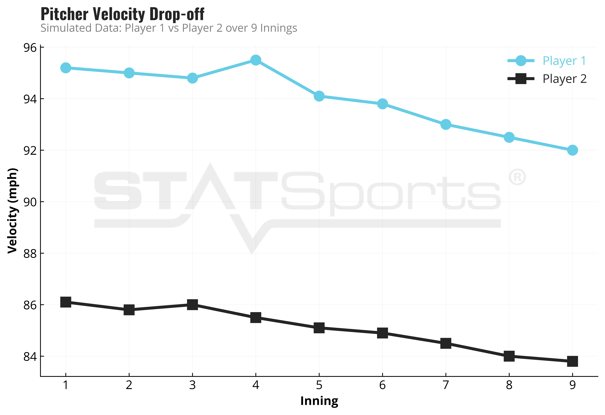

# statsplotlib

STATSports Python plotting utilities. This package provides a standardised wrapper around `matplotlib` to easily create plots consistent with STATSports branding.

If you'd like to contribute the repo currently lives at: [https://github.com/thomasaston99/statsplotlib](https://github.com/thomasaston99/statsplotlib)

## Features
- **Custom Typography:** Automatically registers and applies **Oswald** (titles) and **Open Sans** (body/labels) without requiring system-level font installations.
- **Brand Colors & Styling:** Applies a custom STATSports `.mplstyle` (clean axes, no top/right spines, branded hex codes, thicker lines).
- **Logo Watermarks:** Easily add the STATSports logo to the bottom corner, or as a massive faded background watermark.
- **Presentation Ready:** Toggle between transparent backgrounds (default) and solid white backgrounds.

## Quickstart (Databricks)

Since this package currently lives in the shared Databricks workspace, you don't need to install it via pip (but I can add this in future). Just add it to your path at the top of a notebook, for example:

```python
import sys
import os

# Add the shared library to your Python path
shared_repo_path = os.path.abspath("/Workspace/Shared/statsplotlib")
if shared_repo_path not in sys.path:
    sys.path.append(shared_repo_path)

# Import the wrappers
from statsplotlib.plotting import create_branded_plot, add_branded_title
```

There are also demo scripts in `demos` which shows you how to generate simple plot. For example running `demos/demo_plot.py' generates:

